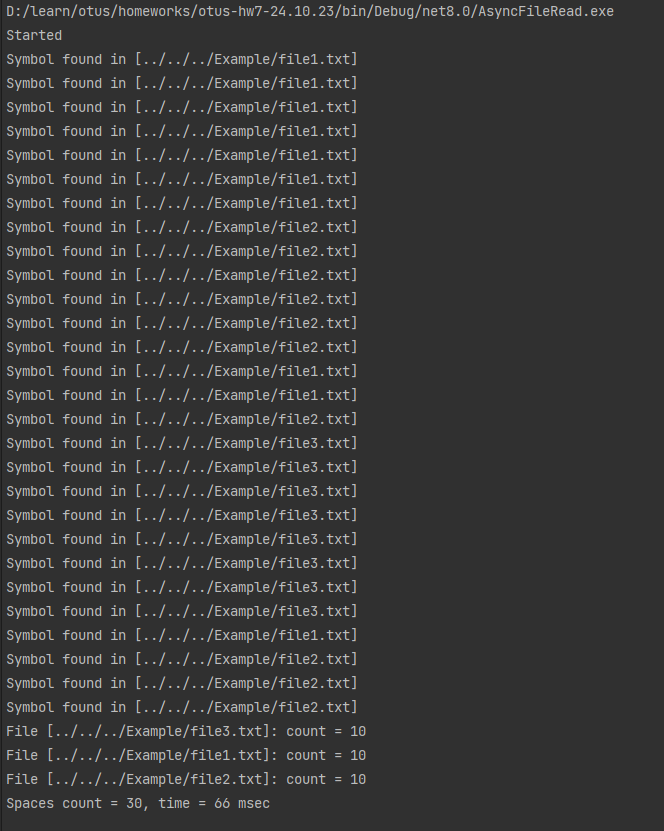

## Введение в параллелизм в .NET. Отличия процесса, потока, домена и таска
###### Вебинар от 24.10.23

### Домашнее задание
Task: Параллельное считывание файлов

**Цель**:  
Студент сделает запуск тасок в параллель, тем самым обретя базовые навыки работы с тасками, что необходимо в повседневной работе C#-программиста

**Описание/Пошаговая инструкция выполнения домашнего задания**:
1. Прочитать 3 файла параллельно и вычислить количество пробелов в них (через Task).
2. Написать функцию, принимающую в качестве аргумента путь к папке. Из этой папки параллельно прочитать все файлы и вычислить количество пробелов в них.
3. Замерьте время выполнения кода (класс Stopwatch).

### Инструкция запуска

1. Склонируйте приложение и зайдите в проект:  
   `git clone https://github.com/antoha-p/otus-hw6-26.09.23.git && cd otus-hw7-24.10.23`
2. Откройте решение и запустите проект:

